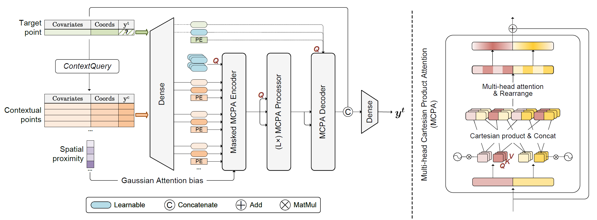

# GeoAggregator: An Efficient Transformer Model for Geo-Spatial Tabular Data

## 🌍 Introduction
This paper introduces GeoAggregator (GA), an efficient and lightweight algorithm based on the transformer architecture designed specifically for geospatial tabular data modeling. 
GAs explicitly account for spatial autocorrelation and spatial heterogeneity through Gaussian-biased local attention and global positional awareness.
This paper also introduces a new attention mechanism that uses the Cartesian product to manage the size of the model while maintaining strong expressive power.

### TL;DR: In the paper, we focus on the spatial regression task...


### ... and propose an efficient and light-weight transformer model named *GeoAggregator*.


📚 Preprint of our GeoAggregator paper is available [here](https://arxiv.org/abs/2502.15032).

## 🪜 Dependencies & Datasets
* Environment requirements are listed in [requirements.txt](https://github.com/ruid7181/GeoAggregator/edit/master/requirements.txt).
Set up and activate the Python environment by running following commands:
```bash
conda create -n ga python=3.9
conda activate ga
pip install -r requirements.txt
```

* All 8 synthetic datasets and 3 real-world datasets can be found under the [data/tabular_datasets](https://github.com/ruid7181/GeoAggregator/edit/master/data/tabular_datasets) folder.

## 🔎 Replicate Our Results
* To replicate a demo experiment of the **GeoAggregator-mini** model on the Housing dataset, run [application.py](https://github.com/ruid7181/GeoAggregator/edit/master/application.py) by:
```bash
python application.py --variant mini --dataset housing
```
For more options:
```bash
python application.py --help
```
* To replicate the baseline experiments, please check [model/baseline_train.py](https://github.com/ruid7181/GeoAggregator/edit/master/model/baseline_train.py).

## 🤖 Use the GeoAggregator
* We provide a simple [sklearn-style interface](https://github.com/ruid7181/GA-sklearn/tree/main) of the GeoAggregator (GA) model, to apply the model on your own geospatial tabular datasets.
Further hyperparameter tuning is made possible through this interface.
