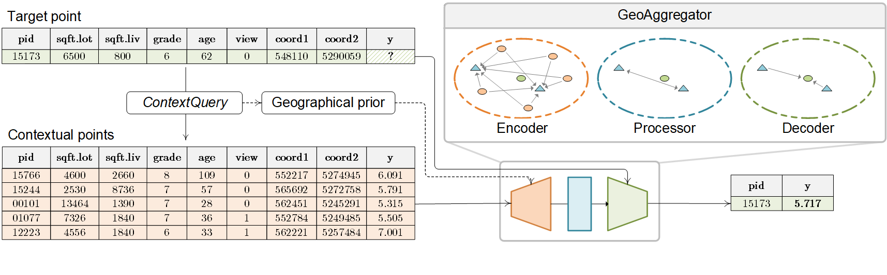

# GeoAggregator: An Efficient Transformer Model for Geo-spatial Tabular Data

## Introduction
Modeling geospatial tabular data with deep learning has become a promising alternative to traditional statistical and machine learning approaches. 
However, existing deep learning models often face challenges related to scalability and flexibility as datasets grow. 
To this end, this paper introduces GeoAggregator, an efficient and lightweight algorithm based on transformer architecture designed specifically for geospatial tabular data modeling. 
GeoAggregators explicitly account for spatial autocorrelation and spatial heterogeneity through Gaussian-biased local attention and global positional awareness. 
Additionally, we introduce a new attention mechanism that uses the Cartesian product to manage the size of the model while maintaining strong expressive power. 
We benchmark GeoAggregator against spatial statistical models, XGBoost, and several state-of-the-art geospatial deep learning methods using both synthetic and empirical geospatial datasets. 
The results demonstrate that GeoAggregators achieve the best or second-best performance compared to their competitors on nearly all datasets. 
GeoAggregator’s efficiency is underscored by its reduced model size, making it both scalable and lightweight. 
Moreover, ablation experiments offer insights into the effectiveness of the Gaussian bias and Cartesian attention mechanism, providing recommendations for further optimizing the GeoAggregator’s performance.



## Dependencies
Environment requirements are listed in [requirements.txt](https://github.com/ruid7181/GeoAggregator/edit/master/requirements.txt).

## Datasets
All 8 synthetic datasets and 3 real-world datasets can be found under the [data/tabular_datasets](https://github.com/ruid7181/GeoAggregator/edit/master/data/tabular_datasets) folder.

## Usage
* To replicate a demo experiment of the **GeoAggregator-mini** model on the Housing dataset, run [application.py](https://github.com/ruid7181/GeoAggregator/edit/master/application.py) by:
```bash
python application.py --variant mini --ds housing
```
For more options:
```bash
python application.py --help
```
* To replicate the baseline experiments, please check [model/baseline_train.py](https://github.com/ruid7181/GeoAggregator/edit/master/model/baseline_train.py).
* To use the **GeoAggregator** model on your own datasets, first go to [configurations/model_config.py](configurations/model_config.py) to register your dataset with an unique name in both `TabDataColumns` class and `RegisteredDS` class. Then, go to [model/aggregator_ds.py](model/aggregator_ds.py) to add functionality of loading the data and normalizing the coordinates to the `TabDataLoaderWrapper` class. Then it’s ready to go:
```bash
python application.py --variant mini --ds YourUniqueDS
```
